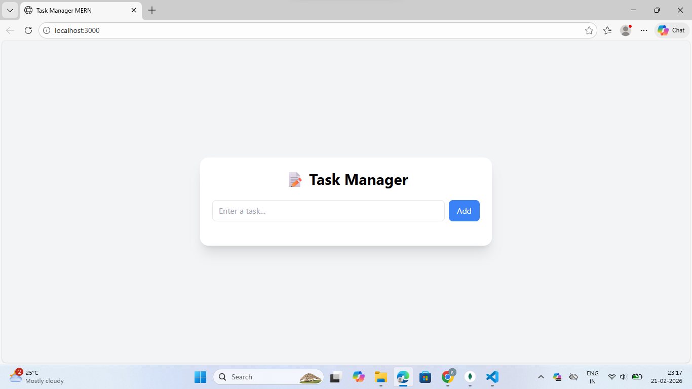
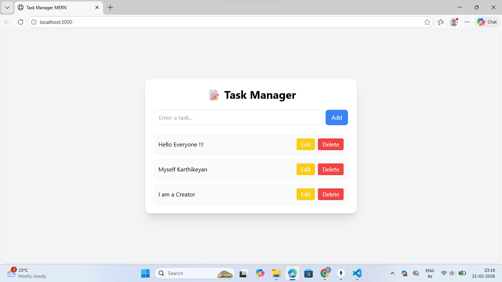
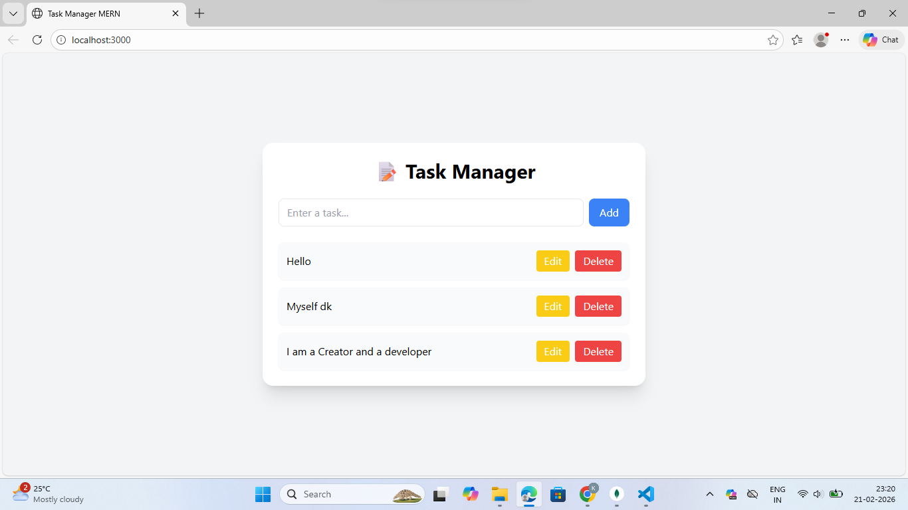
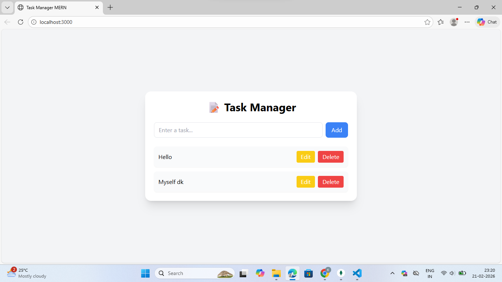

# 📝 Task Manager MERN App

A simple **full-stack MERN Task Manager** built for beginners to learn how MongoDB, Express, React, and Node.js work together.

---

## 🚀 Features

* ➕ Add new tasks
* 📋 View all tasks
* ✏️ Update tasks
* ❌ Delete tasks
* 🔄 Real-time API integration
* 🎨 Responsive UI with Tailwind (optional)

---

## 🧰 Tech Stack

### Frontend

* React
* Axios
* React Scripts
* Tailwind CSS (optional)

### Backend

* Node.js
* Express.js
* MongoDB
* Mongoose
* CORS
* dotenv

---

## 📁 Project Structure

```
task-manager-mern/
│
├── backend/
│   ├── server.js
│   ├── models/
│   ├── routes/
│   └── package.json
│
├── frontend/
│   ├── public/
│   ├── src/
│   └── package.json
│
└── README.md
```

---

## ⚙️ Installation & Setup

### 1️⃣ Clone the repository

```bash
git clone https://github.com/your-username/task-manager-mern.git
cd task-manager-mern
```

---

### 2️⃣ Setup Backend

```bash
cd backend
npm install
npm start
```

✅ Backend runs on: `http://localhost:5000`

---

### 3️⃣ Setup Frontend

```bash
cd frontend
npm install
npm start
```

✅ Frontend runs on: `http://localhost:3000`

---

## 🗄️ MongoDB Setup

1. Install MongoDB Community Server
2. Start MongoDB service
3. Open MongoDB Compass
4. Use connection string:

```
mongodb://127.0.0.1:27017/taskmanager
```

---

## 📦 Dependencies

### 🔹 Backend Dependencies

Install automatically via `npm install`

```
express
mongoose
cors
dotenv
nodemon (dev)
```

---

### 🔹 Frontend Dependencies

```
react
react-dom
react-scripts
axios
tailwindcss (optional)
postcss (optional)
autoprefixer (optional)
```

---

## 🌐 API Endpoints

| Method | Endpoint       | Description   |
| ------ | -------------- | ------------- |
| GET    | /api/tasks     | Get all tasks |
| POST   | /api/tasks     | Create task   |
| PUT    | /api/tasks/:id | Update task   |
| DELETE | /api/tasks/:id | Delete task   |

---

## 🧪 How to Test

* Start MongoDB
* Start backend
* Start frontend
* Add a task from UI
* Verify in MongoDB Compass

---

## 🚀 Future Improvements

* 🔐 Authentication (JWT)
* 📅 Due dates
* ⭐ Task priority
* 📱 Better UI
* ☁️ Deployment (Render / Netlify)

---

## Screenshots

### Create


### Read


### Upadate


### Delete



---
## 👨‍💻 Author

**Karthikeyan D**

* GitHub: add your link
* Portfolio: add your link
* LinkedIn: add your link

---

## ⭐ Support

If you like this project, give it a ⭐ on GitHub!

---

**Happy Coding 🚀**
